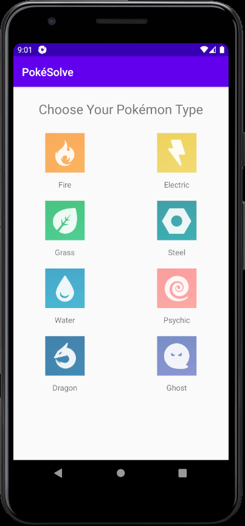
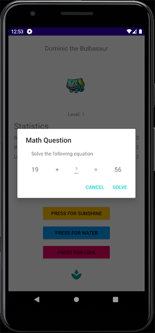
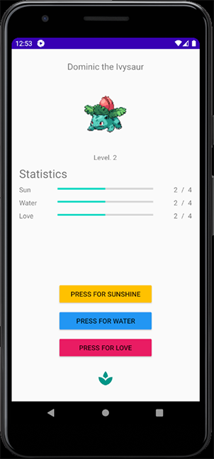

# PokéSolve

Practicing Android app development and testing!

Choose your starter Pokémon, give it a name, and then solve increasingly difficult math problems in order to evolve it!

<h2>To-do</h2>

- [ ] Refactor TextView, Button, and ImageButton IDs
- [ ] Implement polymorphism (removing a large number of switch statements), generify classes and refactor methods
- [ ] Add division math challenges (will have to change from int to handle this)

