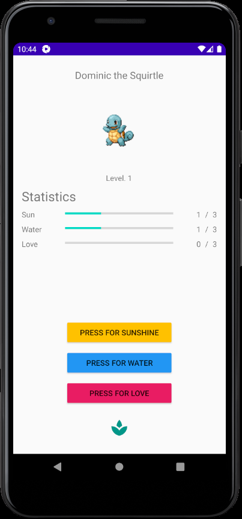

# PokéSolve

Practicing Android app development and testing!

Choose your starter Pokémon, give it a name, and then solve increasingly difficult math problems in order to evolve it!

Once I've completed the MathGame class and tested it, I'll heavily refactor the code and implement polymorphism to clean up a number of methods.

