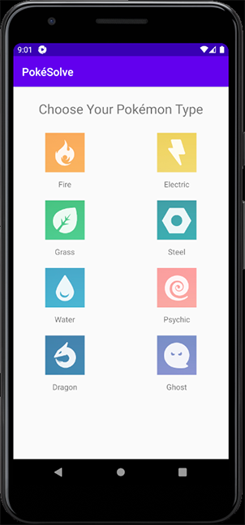
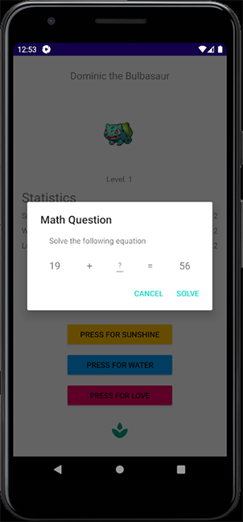
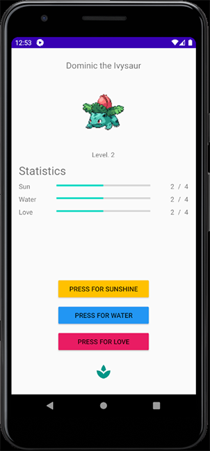

# PokéSolve

Practicing Android app development and testing!

Choose your starter Pokémon, give it a name, and then solve increasingly difficult math problems in order to evolve it!

<h2>Code, Challenges</h2>
<h3>Passing data between activities</h3>
Initially I was simply passing a string between the ChoiceActivity and the MainActivity, where it would hit a switch statement to select which Pokemon object to create.
However after refactoring the Pokemon class, this approach would've undone a lot of my good work. I found Intent cannot handle objects unless they were serialised, so I implemented it for both the Pokemon and the PokemonStatistics classes.

<h3>Switch Statements</h3>
I was honestly addicted to them, which I don't really fault myself for. As this is my first Android application, there has been so much learning and trial and error. My classes, methods, and implementations started out really messy just to cobble something together. However, I've spent a lot of time learning how to refactor, and implement polymorphism into the constructing of my classes. This has made it a lot easier to add additional Pokemon, instead of using a switch statement to both construct the object and then actually populate its unique data (such as sprites, names).

<h3>Animated PNGs for Sprites</h3>
penfeizhou's APNG library was amazing for this. So easy!
This added a lot more character to what was essentially a static screen. I also implemented an ImageView ontop of the sprite to animate effects when the Pokemon evolved.

<h3>Automated Testing</h3>
I've been using Appium and TestNG for automated testing of this project on Amazon Device Farm. This was honestly a nightmare at the start, as dealing with movement between Activities was really difficult. I especially faced challenges with the Alert Modal Dialog pop-ups. After implementing WebDriverWait and the shamefully brute-force sleep(), I overcame a lot of the missing element errors.

After a lot of hair-pulling, I also found Amazon Device Farm doesn't play nice with the debug apk produced by Android Studio when installing the application on the virtual emulator. I had to build with Gradle directly from the command line to overcome this.
I also spent 3+ days trying to force Maven - as Amazon doesn't provide any documentation on how to do it with Gradle - to build the test suite with dependencies inside Android Studio alongside the default Gradle implementation. Eventually I threw in the towel, and now write and build the automation tests in a separate project with IntelliJ. I believe this is mostly Android Studio at fault.

It's also really fun watching the automation suite solve the math challenges, and absolutely puts me to shame.
Snapshot of the code is at the bottom of this readme.

<h2>To-do</h2>

- [x] Refactor all View IDs
- [x] Implement polymorphism (removing a large number of switch statements), generify classes and refactor methods
- [ ] Remove the majority of the hard sleeps implemented in the automation script
- [ ] Shift to POM for my automation classes, investigate using BDD
- [ ] Add multiplication and division math challenges (will have to change from int to handle this)
- [ ] Implement the use of Fragments, so I can add a settings page, allow the changing of nicknames, etc.
- [ ] Learn and understand how to use the Android Activity Lifecycle
- [ ] Eventually explore landscape layouts, and how to better set view constraints

Automation Code Snippet: https://pastebin.pl/view/55c95d10
